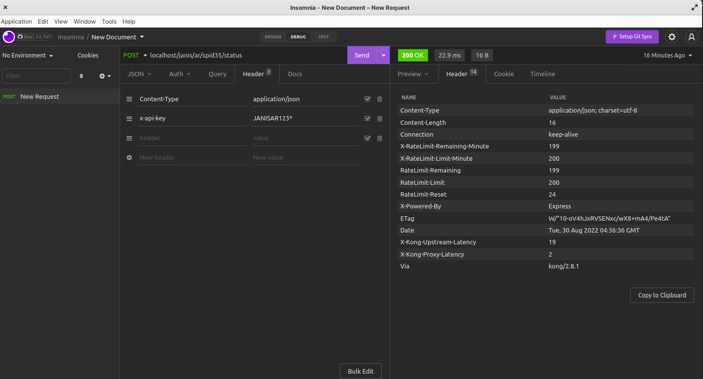
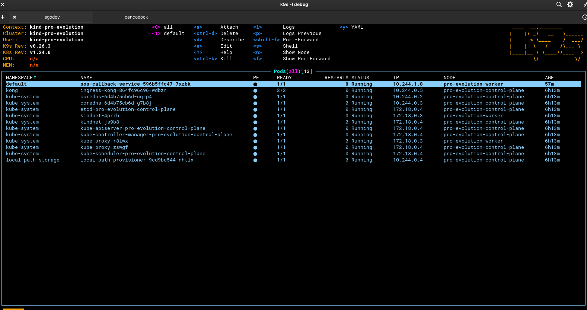

# PRO-EVOLUTION

## Dependencies

- [Docker](https://docs.docker.com/engine/install/)
- [Kind](https://kind.sigs.k8s.io/docs/user/quick-start/#installation)
- [Kubectl](https://kubernetes.io/docs/tasks/tools/)
- [Helm](https://helm.sh/docs/intro/install/)

### Steps
- ```git clone git@github.com:sgodoy17/pro-evolution.git```
- ```cd pro-evolution```
- ```cp .env.example .env```
- set your own variables in the .env (you can leave it as it comes)
- that's all!

### How to run?
This program comes with some useful functions, but, depending on your os, you have to run like the follow (know that you have to be in the root directory, example: ./pro-evolution):

#### Linux
For linux users, if you previously installed the command [Make](https://linuxhint.com/install-make-ubuntu/), you only have to execute the following:
- ```make install``` - this will set up the cluster and docker registry
- ```make status``` - this is for check the status of your cluster/containers on docker
- ```make uninstall``` - With this you can delete you cluster/containers

#### Windows/Mac/Linux
Run the following command in the terminal:
- ```bash ./resources/kind.sh create``` - this will set up the cluster and docker registry
- ```bash ./resources/kind.sh delete``` - this is for check the status of your cluster/containers on docker
- ```bash ./resources/kind.sh status``` - With this you can delete you cluster/containers

### Optional:
If you want to inspect your clusters, you can download [k9s](https://k9scli.io/topics/install/), it's an easy-to-use platform, and it's well documented.

### How to run docker images on local cluster:

- build a docker image (check the Dockerfile in the example folder)
- you need to build a Dockerfile in the root of the project that you want to test
- when you are ready, run the following commands on the terminal
- ```docker build -t my-project:0.1 .``` - change my-project:0.1 for your project-name:version, this command build the image and set up docker for testing
- ```docker run -p127.0.0.1:8081:8081 --rm --net=bind --name my-project my-project``` - this is optional, only if you want to try a test the application with the docker image 
- ```docker tag my-project:0.1 localhost:5001/my-project:0.1``` - with this you are tagging your local image
- ```docker push localhost:5001/my-project:1.0``` - last, we push the tagged image to our local registry

### How to use my docker image with my local cluster

Open the deployment.yml file and change the image for the one that we build early

example:

```yaml
...
containers:
  - name: my-project-name
    image: localhost:5001/my-project:0.1
    imagePullPolicy: IfNotPresent
...
```

### How to create api keys on the cluster

You need to run the follow command: ```kubectl create secret generic {name} --from-literal=kongCredType=key-auth --from-literal=key={secret}```, change {name}/{secret} with your owns values

example:

```
kubectl create secret generic my-api-key --from-literal=kongCredType=key-auth --from-literal=key=my-api-secre
```

### How to create acl groups on the cluster

You need to run the follow command: ```kubectl create secret generic {name} --from-literal=kongCredType=acl --from-literal=group={group}```, change {name}/{group} with your owns values

example:

```
kubectl create secret generic my-acl-group-name --from-literal=kongCredType=acl --from-literal=group=my-acl-group
```

#### NOTE:
For the case of sos-callback api, we need to set up the localstack, you can set up easily with this [repo](https://github.com/sgodoy17/cencodock) that is already configured with the network of this cluster

The default endpoint for this is localhost/127.0.0.1

If you follow all these instructions, you'll probably see something like this:




